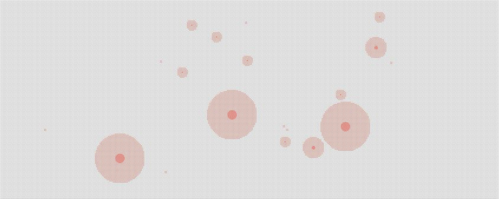

[](https://github.com/thecodemonkey/kennste/actions/workflows/main.yml)


# Kennste 

> ### Kennst du Jemanden, der Corona hatte? <br/>
> *Ich meine nicht den Kumpel des Schwagers, sondern einen direkten Verwandten oder einen Freund, den du wirklich gut kennst.*
> ### Du kennst Niemanden? 
> *Findest Du das nicht irgendwie komisch? Wenn man sich die Politiker, Wissenschaftler und vor Allem die Medien anhört,
> dann müsste eigentlich Jeder, Jemanden mit einer COVID19 Erkrankung innerhalb seines direkten sozialen Umfeldes kennen?*
> ### Hmm, vielleicht ist COVID19 **gar nicht so schlimm**?

<br/><br/>
Viele von uns kennen mittlerweile diese Fragen und Diskussionen. Auch ich selbst habe mir diese Fragen gestellt. 
Auf der Suche nach Antworten, habe ich mich ebenfalls bei den alternativen Medien umgeschaut. Für einen Nerd wie mich, sind es vor Allem **Daten** und **Algorithmen**. 
Dies hat mich dazu bewogen eine eigene **COVID19 Simulation** zu entwickeln. 



## COVID19 Simulation

Als Erstes soll die primäre Frage beantwortet werden, warum so wenige Menschen direkte COVID19 Erkrankte kennen?
Um diese Fragen zu beantworten, analysiere ich verschiedene statistische Informationen, die **uns Allen** zur freien Verwendung vom z.B. Robert Koch Institut
bereitgestellt wurden. Anhand dieser Daten und mit dem bisherigen Wissen, über die Infektionsketten(1 Mensch kann weitere Menschen anstecken usw.) habe ich eine Simulation entwickelt,
die das Infektionsgeschehen visualisiert und auf eine spielerische Art uns Weise verschiedene Erkenntnissen liefert.

Die zweite Frage, die unterschwellig mit der ersten Frage mitschwebt ist, ob CORONA tatsächlich ein Killer-Virus ist?
Dazu verwende ich die Daten aus dem DIVI-Intensivregister, um die Auswirkung des Infektionsgeschehens auf das Gesundheitssystem zu analysiert.

Dabei ist dieses GitHub Repo entstanden.


## Die Philosophie hinter dem Projekt

Während der Pandemie hat sich ein weiteres gesellschaftliches Problem aufgetan. 
Auf der Suche nach der Wahrheit wurden immer mehr Konstanten zu Variablen deklariert. 
Wenn eine Gleichung ausschließlich aus Variablen besteht, dann wird man niemals zum Ergebnis gelangen, und somit wahrscheinlich nie die Antwort auf die Fragen bekommen.
Und genau hier liegt das Problem.

Unabhängig von dem, was die Medien und Politiker erzählen, war bislang vor allem die 
Wissenschaft so eine Konstante. Dieser Konstanten, haben wir vor allem den sozialen Fortschritt zu verdanken.
Sie ist der Grund, warum 90% von uns(damit ist in erster Linien der europäische Raum gemeint.) nicht mehr 14 Stunden lang am Tag in einem Bergwerk oder auf einem Feld schuften müssen. Sie ist der Grund warum es heute Begriffe, wie Urlaub oder Freizeit gibt. 
Noch bis vor gerade mal 300 Jahren waren diese Privilegien nur ganz wenigen Menschen auf der Welt vorbehalten. 

Wissenschaft ist der Grund warum wir heute dort stehen, wo wir sind. 
Diese Konstante wieder zu einer Variablen zu deklarieren oder gar darauf zu verzichten, würde das Rad sehr, sehr weit zurückdrehen.    

Wir müssten anfangen zu hinterfragen, ob eine Kopfschmerztablette, die mein Arzt mir verschreibt evtl. doch schädlich für mich ist.
Wir müssten anfangen zu hinterfragen, ob meinen Kindern das Richtige in der Schule beigebracht wird.
Ob die Erde rund ist, ob Elvis wirklich tot und ob die Realität in wirklichkeit nur eine Projektion der Matrix ist?

**WIR MÜSSTEN EINFACH ALLES, WAS WIR KENNEN INFRAGE STELLEN!** 

Und wenn wir das Alles hinterfragen würden, was an sich noch nicht mal wirklich schlimm wäre. Denn ein bisschen "Quernachzudenken" tut tatsächlich manchmal gut. Wenn genau fragen wir dann? 
Soll jetzt einfach Jeder 6 Jahre lang Medizin studieren, um am Ende sich selbst die Frage zu beantworten, ob eine Kopfschmerztablette wirklich schädlich ist oder nicht? Und was ist, wenn wir weder den Büchern noch den Professoren vertrauen? 
Wenn wir nicht in der Lage sind, diese Frage selbst zu beantworten, wenn fragen wir dann?
Vielleicht einen veganen Koch oder einen Schlagersänger? Oder landen wir am Ende wieder bei Jemanden, der sich bereits ausführlich mit diesem Thema befasst hat? 

Eine einfache Frage hat of einen sehr komplizierten Weg bis zur Antwort. 
Es ist unmöglich auf all diese Fragen, im Alleingang die Antworten zu finden. Wir werden an dieser Stelle immer wieder auf jemand Anderen angewiesen sein, der uns auf all diese Fragen mit Hilfe der altbewährten Konstanten die Antworten liefern kann.
Und wenn wir das erkannt haben, dann werden wir diese Konstanten, vor allem die Wissenschaft, wohl weiterhin akzeptieren müssen. 

Es seiden, die wahre Antwort ist nicht wirklich Das, wonach wir suchen.

### Raketenwissenschaft schadet

Wissenschaft als Grundlage zu nehmen und vor allem den Wissenschaftlern zu vertrauen ist ein wichtiger Punkt, um die Antworten zu finden.
Allerdings ist es so, dass die Wissenschaft den Anspruch hat sehr präzise zu sein. Diese akademische Präzision ist 
sehr nützlich, wenn es z.B. darum geht einen mathematisch unwiderlegbaren Beweis zu erbringen. 
Sie eignet sich allerdings nicht besonders gut, wenn man komplexe Sachverhalte den außenstehenden vermitteln möchte.

Diese Präzession enthält eine Menge Komplexität, die nicht so leicht zu verdauen ist. Und genau hier liegt das Problem. 
Wissenschaft wirkt an dieser Stelle auf die meisten Menschen nicht unbedingt wie eine Einladung mit Herzchen und Blümchen, sondern eher wie eine Mauer mit Stacheldraht. 
Sie schafft Distanz zwischen den Wissenden und den vermeintlich Unwissenden. Sie kann unter umständen sogar sehr herablassend wirken, was viele Menschen dazu bewegt
nach alternativen Fakten zu suchen. 

Deshalb ist es wichtig die Essenz aus einer komplexen Materie zu extrahieren, um diese anschließend mit einfachen Worten zu vermitteln.

> Und weil Raketenwissenschaft oft schadet, und ich weder ein Wissenschaftler noch ein Virologe oder sonst irgendein Experte in diesem Bereich bin, hat dieses Projekt auch nicht den Anspruch eine perfekte COVID19 Simulation zu sein.
> Ich bin nur ein Programmierer, also quasi nur ein Spielkind mit einer Tastatur in der Hand, mehr nicht :-) 


## Das Ziel dieses Projektes ist

1. Beantwortung folgender Fragen:


- Warum kennen verhältnismäßig nur wenige Menschen andere COVID19-Erkrankte
  aus ihrem unmittelbaren sozialen Umfeld, obwohl die Infektionszahlen als 
  extrem hoch von der Wissenschaft, Politik und den Medien dargestellt werden?   

- Ist Corona wirklich ein Killer-Virus oder ist das Alles nur Panikmache oder gar Verschwörung?


2. Interesse für Daten und Fakten wieder zu wecken.
3. Coden, Daten visualisieren und einfach mal ein Nerd sein ;-)


# Technik und co.

Die Anwendung ist in Angular 11.x und Typescript 4.x geschrieben. Etwas HTML hier, bisschen CSS da usw.

---

## Anwendung lokal ausführen


```bash  
 
 
  git clone git...                          # 1. Repository clonen oder als Zip runterladen und enpacken
  
  npm install                               # 2. externe Packages lokal installieren
  
  ng serve                                  # 3. Anwendung starten
    
  start chrome http://localhost:4200/       # 4. Im Browser öffnen und Spaß haben ;-)
   
``` 

**Technische Voraussetzung:**

[Node.js > v12](https://nodejs.org/de/)


## Daten

folgende Datenquellen werden für die Analyse und Simulation verwendet:

xxx

## Wie genau funktioniert die Simulation

xxx


## Contribution ist ausdrücklich erwünscht!

Wenn Du Interesse hast an dem Projekt mitzumachen, 
dann <a href="https://twitter.com/chillya"></a>  oder stelle direkt einen PR oder ein Issue in diesem GitHub Repo ein. 

Übrigens, Du musst dafür kein Programmierer sein. Du kannst auch gerne das Projekt auf social media supporten oder einfach 
mal deine Gedankengänge zu dem ganzen Thema beisteuern. Oder Du hast Lust die Anwendung zu testen oder, oder, oder...  
